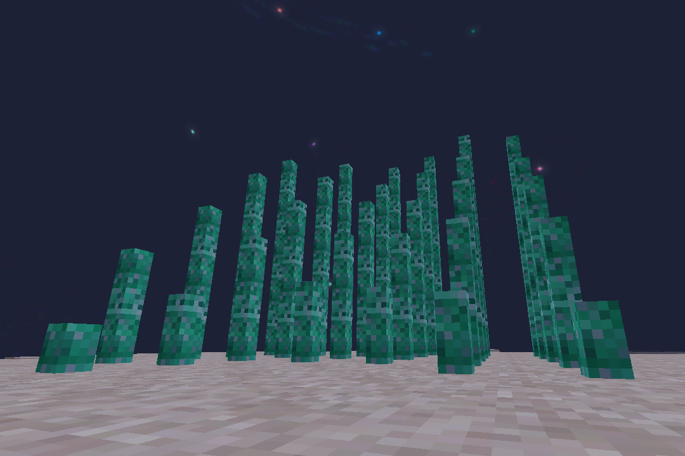

# NodeCore Bells
_Totally tubular!_

Bells are crafted like grooved panels, but on an anvil. Ring bells using a lode bar or rod.

Shorter bell = higher note, taller bell = lower note. Each node of height lowers the octave. The default note is A.
